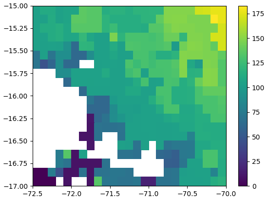

# rainfall_onset2

**This is an updated version of [adrHuerta/rainfall_onset](https://github.com/adrHuerta/rainfall_onset)**. 

In [adrHuerta/rainfall_onset](https://github.com/adrHuerta/rainfall_onset) I focused on the methodology of [Liebmann et al. (2012)](https://doi.org/10.1175/JCLI-D-11-00157.1), therefore the code is not as fast as expected, and can not be directly used for gridded data.
Here I provide a faster version using (almost) pure R/python.

  

*Figure. Sample total precipitation (mm) in the first year for the wet period. Data source: [PISCOp](http://iridl.ldeo.columbia.edu/SOURCES/.SENAMHI/.HSR/.PISCO/.Prec/.v2p1/.stable/.daily/)*
